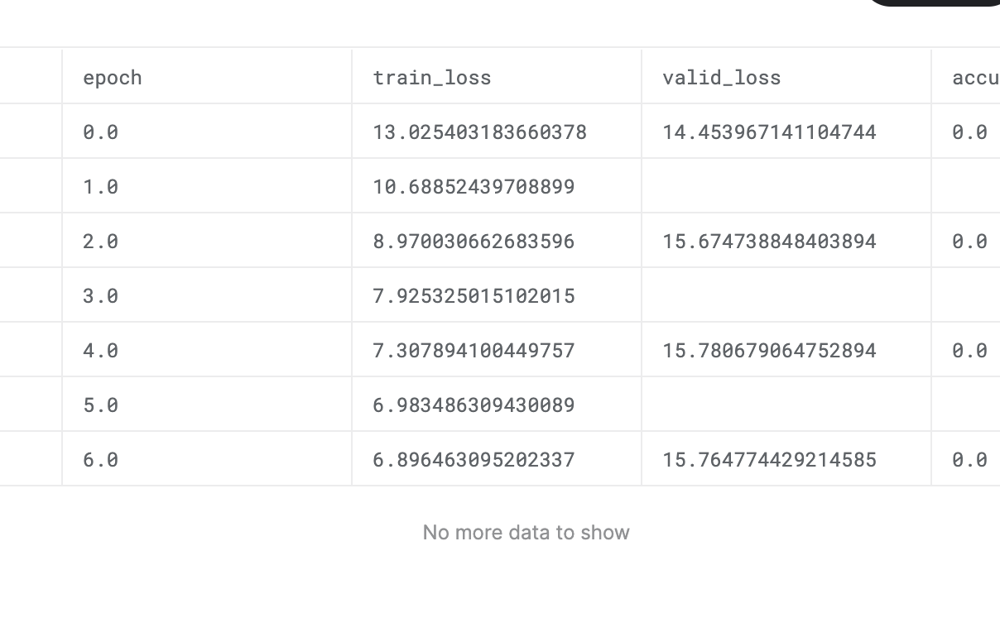
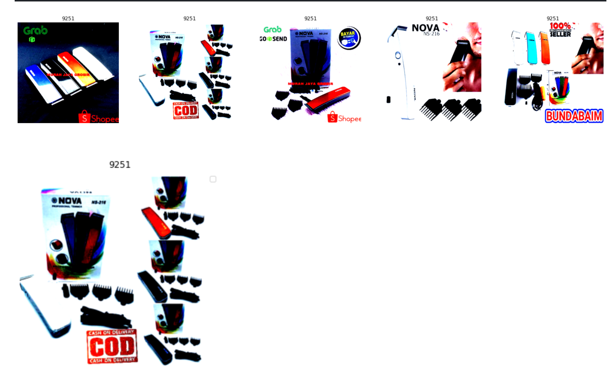
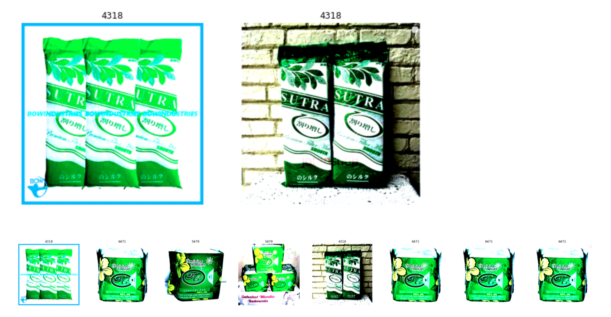

# kaggle-shopee
kaggleのshopeeコンペのレポジトリ

 

<br>

# 概要
- 同じ商品を見極める
- 与えられるデータは商品のタイトル(売った人が出した説明文的な)と商品の画像

<br>

# 指標
- 一つの商品ごとにその商品と同じ商品だと予測される他の商品を出力する
- 一つの商品ごとにF1scoreを計算してそれを平均する
- f1scoreは以下で表される量でrecallとprecisionのバランスをとっている. 

```
precision = TP/(TP + FP)
recall = TP/(TP + FN)
f1score = 2/(1/precision + 1/recall)
```

- f1scoreは閾値の設定も大事らしい(byKaggle本)

<br>

# 目標
- pytorchにもっと慣れる. 
- 2回目の画像コンペなので銅メダル
- googlecolabを有効活用する. 

<br>

# Notebook
[1. EDA](https://www.kaggle.com/ruchi798/shopee-eda-rapids-preprocessing) 
- edaのnotebook, 画像とかpandasの部分は自分でもできたが, NLPのとこはどんなことをすれば良いのかわからないので参考にする. 
- wordcloud
- bag-of-word : 単語に含まれる語彙をベクトルかしたもの. 
- 「stopword除去などの前処理 -> bag-of-wordでベクトルに変換 -> 類似している文をknnで探す.」 ということをした. 
- RAPIDSはGPUでの計算を効率よくするもの? [link](https://rapids.ai/)
- NLTKはNaturalLangageToolKitの略で自然言語処理に関するライブラリ. 

[2. Submission,CV](https://www.kaggle.com/underwearfitting/pytorch-densenet-arcface-validation-training)
- GroupKFoldでのCVをしている. 
- arcfaceという損失を用いたもの
- まずは普通にclass分類としてやってみてから, これをやってみる. 

[3. CV](https://www.kaggle.com/tmhrkt/shopee-cv-splitting-way)
- CVをlabel_groupとimagehashを用いて分けている. imagehashやlabel_groupが同じものは同じfold内に存在しないように分けている. 
- image_phashにも気をつけないといけなかった. 

[4. unsupervised](https://www.kaggle.com/cdeotte/part-2-rapids-tfidfvectorizer-cv-0-700) 
- textをtfidfでベクトル化して, KNNする
- いろんな言語が混じっているから, tfidfの方がBERTとかいうものよりも良いのかも? 

[5. word2vec](https://www.kaggle.com/coder247/similarity-using-word2vec-text)
- wordをベクトルにembeddingsする方法
- simpleで使い方がわかりやすかった. 

[6. bert](https://www.kaggle.com/ragnar123/bert-baseline)
- tensorflowでbertの実装をしている. 
- やりたい. 

<br>

# Log 

***20200324*** 
- コンペ参加し, 概要を把握した. 
- ざっとdiscussionとnotebookをみた. 自然言語処理っぽいところも重要らしい?
- arcfaceとか見慣れない単語がある. 
- 分類でも回帰でもないじゃん. それぞれのクラスについての分類として考えられなくはないけど, それはクラスごとにモデルを作ることになって現実的に不可能. 
- ↑こういう種類の問題ではmetric learningが使われるらしい. arcfaceとかはその時の指標の一つ? 
- ちょっと自分でedaをした. nb01
- みてた感じ似たような画像を使っている場合は画像で行けるかもしれないけど, titleの方が重要な情報を含んでいそう. 
- datasetをgoogle driveにuploadした. 

**20200325**
- nb01 
    - wordcloudを初めて使った. 英語ではない言語が入っている. 
    - edaのnotebookを参考にしつつbag-of-wordしてから, knnなどをした.
    - bag-of-word程度じゃ全然意味なさそう.
- とりあえずNLPパートは放っておいて, 画像パートをやる.  
- cvのやりかた
    - label-groupをつかってGroupKFold
    - train-setには含まれないがtest-setに含まれるlabelがあるかどうかが問題, [これに関するdiscusssion](https://www.kaggle.com/c/shopee-product-matching/discussion/224855). 
    - これはクラス分類(uniqueなclassは11014なので11014クラス)として捉えた時の話
    - とりあえずGroupKFoldでクラス分類の教師あり学習をしてみて, cvとlbの相関を見るべき. もし相関があるならtestdataもtraindataと同じlabelを持っている可能性が高いし, なければ全然違うlabelでできている可能性が高いと思う. 
    - nb02でとりあえずGroupKFoldした. 
- [このdiscussion](https://www.kaggle.com/c/shopee-product-matching/discussion/225543)を読んでいる限りだと, traindataと同じlabelを持っているとは考えられない? 
    - 普通にクラス分類としてtrainingしてから, softmaxをかける前の出力を用いてcosを求めるというのもありらしい. 
- nb03 
    - 普通のclass分類モデルを作り始めた. 
- transformer -> bert 
- 教師ありconstrastive learning

**20200329** 
- pytorchわかんないのでとりあえず, arcfaceでのtrainingをすることにした. 
- nb04 
    - とりあえず写経している.
    - 距離学習 [link](https://qiita.com/yu4u/items/078054dfb5592cbb80cc)
    - なんでarcfaceのとこでxを正規化してないの? 
    - と思ったらしてた. 
    - AMPはAutocast Mixed Precisionの略で計算の速度を早くする手法? 
    - デバッグしてとりあえず学習できた. 
    - 明日f1scoreの閾値最適化の部分と, submitcodeを書く. 
- [discussion](https://www.kaggle.com/c/shopee-product-matching/discussion/228537) 
    - 明日みよう
    - いろいろなこれまでの手法が見れる. 
- CVの切り方を変える. 
    - image_phashも考慮してGroupKFoldする. 
- OCR
    - 画像の中の文字をOCRで読み取って利用するという手もあるらしい

**20200330** 
- nb04 
    - thresholdoptimizerを実装した
    - 今のところ適当な範囲を指定して探索しているだけ
    - 学習がまだ終わってないけどlogをみている限り, バグっているような気がする. 
- colab
    - nb04をcolabでも学習できるように整備中
    - pytorchのメモリの管理ができない


**20200331**
- nb06
    - nb04の方法だと9時間で終わらないのでvalidationの頻度を減らして実行した
    - CV = 0.7384となった. -> LB 0.543
    - thresholdが0.6だと小さすぎるっぽい. ので0.8にしてみた. -> LB 0.658
    - LBに対してthresholdを最適化しないといけない...,PublicLBに対してoverfittingしちゃう...
    - 昨日のやり方だtrainlossを出力していなかったので, lossを出力するようにして, 再実行した. 
    - おそらくだけど, めちゃくちゃtraindataに過学習しているのでheavyaugmentationが効きそう? -> nb07
    - これは...
     
    - 実はもっと小さいモデルeffcientnetB0とかの方がいい説がある. 
    - どんな画像に対して間違っているか確認する
- nb05
    - submit
    - 普通にsubmitするとメモリが足りないらしく, データを分けてcosin similarityを計算するようにした
- colabnb06
    - colabで実行できるようにした
- nb08 
    - どんな画像に対して間違っているか確認する
     
     

- textにも手を出したい
    - tfidf
    - bert
    - bertなら翻訳しないといけない? 

- [過去コンペのデータ](https://www.kaggle.com/terterter333/shopee-product-detection), 画像のみがあるらしい
    - 10GBくらい
    - クラスと画像があってこれで分類モデルをつくってから最後にこのコンペのデータでfinetuningする. 
    - データの被りが無いかどうかがきになる.


**20200401**
- nb05 
    - thresholdを0.75,0.85versionもやってみた. 
    - cvはth = 0.65のときに最大で0.7384だった. 

|th|lb|
|:--:|:--:|
|0.65|0.546|
|0.70|0.612|
|0.75|0.646|
|0.80|0.658|
|0.85|0.658|

- nb07
    - めっちゃheavyなaugmentationしたら, 全然学習していなかった. 
    - まともなスコアが出ていないのでもうちょっと緩める
- nb09 
    - effcientnet_b3を試してみる. 
    - timmの使い方がよくわからん...
    - 画像サイズが小さいとbatchsizeが大きくできて嬉しい. 
- これからやるべきこと
    - weight regularizationありのdensenet121
    - channel_size(embeddingのサイズ)を小さくする
    - nfnetとかいうのを試す
    - tfidf
    - bert(翻訳が難しい?)

**20200402** 
- nb09 
    - effnet_b3のtrainingでもlossの下がり方から同じくらい過学習している気がする. 
    - **よく考えてみるとcos(\theta + m)とした後にlossを計算していてそれはなんか違くないかという感じになった.**
    - ↑これそうでもない気がしてきた. よくわかんない. 
    - cv = 0.715くらい(densenet121と同じエポック数で比べると少し良いcv)
    - weight_decayをするべき
    - weight_decay=1e-6でそれ以外の条件を全く変えないとcv = 0.7108だった. 
    - weight_decay強すぎ? もうちょっと小さくする? 
    - OptimizerがAdamWじゃないと意味ない説がある. 
    - colabで回す
- nb10
    - nb09のeffnetの提出をした. (weight_decayなし)
    - もしかしてcvとlbの相関が取れていそう? 
    - もうすこし考える必要あり
    - 下の表ははweight_decay=1e-6(cv = 0.7108)ver
    - やっぱり?相関取れてそう

|th|lb|
|:--:|:--:|
|0.70|0.540|
|0.80|0.634|


|th|lb|
|:--:|:--:|
|0.70|0.539|
|0.80|0.630|
|0.85|0.645|

- nb11
    - tfidfをする
    - 特に頑張ることがない
    - あえていうとstopwordsに特有のものを取り除くとscoreがあがったりするか? 
    - emojiとかは異常にたくさんあったし, それほど特徴として寄与しなさそうなので消したい
- todo
    - tfidfを回す
    - weight_decay=1e-7,1e-8くらいを回す
    - nfnet
    - bert 
    - channel_sizeを小さくする. 
    - 前のデータでpretrainする. 

**20200402**
- nb06 
    - densenet121でweight_decay=1e-4,AdamWで回したが, weight_decayなしの時より, val_f1scoreが減少した. (なし0.7384 -> あり0.7354)
    - weight_decayはSGDの方が効くらしい
    - やっぱりこのcvの切り方はめちゃくちゃ良さそう. 

|th|lb|
|:--:|:--:|
|0.70|0.610|
|0.80|0.658|
|0.90|0.647| 


- nb11
    - tfidfをした
    - th = 0.70で cv = 0.6139(ただtfidfをつくってcosine similarityを計算しただけなのでcvではないけど) 
    - todo
        - thを変える.
        - tfidfをnnに入れる

- nb13
    - label_smoothingつきcrossentropyを実装していたら, pytorchわかんないのでめちゃくちゃ時間かかった. 
    - colabが動いてくれない. 

- nb14 
    - textのembeddingとimageのembeddingをどうやってensembleするか考える
    - それぞれsimilarityを計算して
        - 足す?
        - 掛ける? 
        - max 
        - min 
    - それともちかいlabelを撮ってきてから
        - and 
        - or 

**20200404**
- nb13
    - label_smoothing=0.05のeffcientnetb3だとepoch=28,でcv = 0.75853だった. label_smoothingはかなり効いてるとおもう. 

|th|lb|
|:--:|:--:|
|0.80|0.650|
|0.85|0.660| 

- nb14
    - textのただtfidfしたやつと, effcientnetb3でcvを出したら, cv = 0.8118くらい
    - textの方はlabel_groupでgroup_kfoldしたのでこのCVがよいCvかどうかは不明. 
    - text_th = 0.70,image_th = 0.70
    - text_th = 0.80にすると, cv = 0.7941

- nb15
    - textとうえのeffb3で合わせてsubmitした. 
    - とりあえずCPUにしてしまった. 
    - 全く同じものをGPUでだした. 
    - GPUは15分くらい. 
    - text_th = 0.70だとlb = 0.571だったので少し調整すべき. 
    - text_th = 0.80だとlb = 0.621だった.
    - よく考えるとtestsizeの方がでかいからthももっと大きくすべきだなと持った. 
    - 正規化しているわけではないからcosでもないし, -> TfidfTransformerは内部で正規化している. 
    - submit時はexit()して時間を節約した.  

- nb16
    - nfnetを動かそうとしてみたが, あまりうまくいかなさそう. 
    - lossが発散しそう
    - というかもっと他にやるべき優先順位の高いことがある気がする. 

- todo
    - ranzcrで使われてた手法をためす. 
    - bert
    - channel_sizeを小さくする
    - 前のコンペのデータは使っていいか怪しいらしい. 

**20200405**
- nb15
    - 全く同じコードをgpuとcpuで提出したら結果が違ったので原因はgpuの倍精度演算の精度によるものと考えてすべてnp.float32にキャストしてから行列演算を行うものを提出してみた. 
    - gpuだと0.571でcpuだと0.707はさすがにおかしいとおもう. 
    - 確認してたらなぜかはよくわからないけれど, gpuではimageとtextのmatmulした後の計算結果が同じになっていた. 
    - なんで? 
    - ばかなミスがあった. 
    - 明日用の正しいsubを作っておいた. 

- nb01
    - 出現頻度の高く意味のなさそうな顔文字などの情報を消してみる. 
    - textの方をもっとちゃんと利用したい. 
    - dictみたいに与えられるデータに対して高速に文字列を置換する関数が欲しい. 
    - replaceがうまくいかない... 

- 過去コンペのデータは使えないらしい.

**20200406**
- nb06 
    - label_smoothingありだとcv = 0.7346817となった. 
    - なしより下がった

- nb15
    - いろいろミスがあったが, effnetのbestcvのモデルで以下のスコア
    - image単体モデルでのlb最高のsubmit th = 0.85で固定. 
    - image_cv = 0.7585
    - image_text_cv = 0.81180
    - (1fold分)
    - nb14(vesion8参照) 


|text_th|lb|
|:--:|:--:|
|0.70|0.707|
|0.80|0.703|
|0.90|0.687| 


    - densenetのbestcvのモデルでのスコア
    - image単体モデルでlb最高のsubmit th = 0.80で固定. 
    - image_cv = 0.7332888
    - image_text_cv = 0.800089
    - (1fold分) 
    - nb14(version11参照) 


|text_th|lb|
|:--:|:--:|
|0.70|0.714|
|0.80|0.707| 


    - あまりcv安定してない? 
    - textがunsupervised(tfidfしただけ)なのでそれと合わせると安定しなくなるのかも? 

- nb17
    - word2vecを理解する(must)
    - 理解してから実装をみる. 
    - [word2vec(Qiita)](https://qiita.com/Hironsan/items/11b388575a058dc8a46a)
    - word2vecは単語を入力として周辺にある単語が存在する確率を予測するモデルを作り, その重みを使うことで単語をベクトルにする. 
    - 訓練時の入力としては単語をonehot表現で表したもの. 
    - targetは周りにある単語とする.(これはwindowsizeにより変化する) 
    - 2層で隠れ葬の活性化関数に高等関数を用いているので, 結局近い単語のベクトルの内積を大きくするみたいな方向に訓練をする無用にしている.
    - 明日学習済みモデルとかをみる. 

**20200407** 
- nb13
    - effcientnetb3でもlabel_smoothingなしの方がcv = 0.75950で最高だった. 
    - やっぱりlabel_smoothingは意味ない説がある. 
    - text(tfidf)ありだと, cv = 0.8106122なのでtextと混ぜると前のlabel_smoothingありのeffnetの方がcvがよかったということになった. 

|th|lb|
|:--:|:--:|
|0.80|0.647|
|0.85|0.660| 
|0.90|0.657| 


    - 前のeffnetとlbはそんなに変わらない? 

- nb17
    - word2vecでtrainingしている. 
    - 学習済みモデルの方がいいんじゃないか感がある. 
    - gensimがlogを出してくれない. 
    - 公式のやり方でもできない. 
    - このデータしか使ってないからかわかんないけど, めちゃくちゃcvが悪い. cv = 0.12くらい. 

**20200410**
- nb13
    - effcientnetb3,label_smoothingなし, imsize=300でfold0では良かったのでfold1,fold2も同様に回した.
    - kaggleをやる時間が取れなかったのでとりあえず回しておく形にした. 

- nb17
    - word2vecは学習済みモデルを用いないで, 頑張るとcv = 0.511くらいが限界でtfidfの方がよかった. 
    - 英語の学習済みモデル+インドネシア語を英語に翻訳をすると, もっと良くなるかも? 

- nb19
    - ensembleをsimilarityの足し算とかで行うようにしてみた. 
    - これまでの方法だと(labelをつけてから和集合をとる), アンサンブルするにつれてlabelが単調増加してしまうので, こちらの方が良いのではないか. 
    - 足算して閾値をちょっと調整すると, cv = 0.8392くらいになった. 
    - 足し算の方がアンサンブルの効果が高そう. 

- nb20
    - 足し算でアンサンブルするようにしたバージョン. 
    - cvは上のnb19を参考にすると, cv = 0.8392くらい. 
    - tfidf+model2個で32-35分くらい. 

|th|lb|
|:--:|:--:|
|0.30|0.466|
|0.50|0.466|
|0.60|0.466|
|0.70|0.466|
|0.80|0.466|
|0.90|0.466| 

    - 全部同じになるなんてことがある? 
    - バグらせている気がする. 
    - それかthがもっと小さい方がよい? 
    - textはめっちゃ疎なベクトルになってそうだし. 

- nb21
    - bertのnotebookを写経する. 
    - まだbertについてよくわからないのでできない. 

**20200411**
- nb21
    - 動かせる形にしたので, 動かしてみる. 

- nb20
    - 足算してアンサンブルしたやつがすべてscore=0.466となってバグっている気がする. 

- nb08
    - どこを間違っているかみてたんだけど, これは確かに似てるよね...みたいなものを似ていると判断していて, textはそのまま採用して, 画像はかなり類似度が高い時のみ, 同じであると判定するようにアンサンブルする方が良い気がしてきた. 

**20200412**
- nb13
    - augmentationをちょっと強くしてCenterCropを入れたらほんの少しf1scoreがよくなった. 
    - cv = 0.76130...
    - image + tfidfのcv = 0.808284...
    - lb = 0.700
    - となった. 

- nb21
    - bertを動かした. 
    - forkしたnotebookはvalidationの切り方がよくないような気がしていて, きちんとgroupkfoldしたら, lossはあそこまで下がらなかった. 
    - imageよりlossは大きい. 
    - cv-f1scoreが全然だめ...

- nb16
    - nfnetの学習. 
    - lossがnanにならないことを祈る. 
    
- nb23
    - textでidを予測, imageでsimilarityを平均してidを予測, textとimageの予測をorでくっつけるようにしたらよかった. 

- distilationを試してみたい. 

**20200413**
- nb24
    - [cassava conpetition](https://speakerdeck.com/sansandsoc/diary-against-the-noisy-label)に載ってたnoisy labelに対処するSymmetric Lossを試してみたら, cv = 0.762..で改善した. 
    - effnetb4も試してみる. 

- 今日気づいたんだけど, 実は0.466はなにかのバグでpredが作られておらず, submission.csvがそのまま提出されているときに起こるバグなのかもしれない. 
- 途中でエラーになってもsubmission.csvがそのまま提出される仕様になっていたっぽい. 
- 必要メモリが大きすぎてmemory errorを起こした場合とか. 


