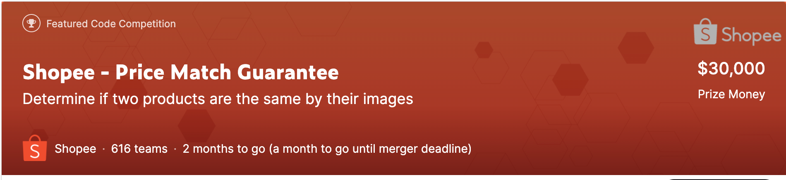

# kaggle-shopee
kaggleのshopeeコンペのレポジトリ

 

<br>

# 概要
- 同じ商品を見極める
- 与えられるデータは商品のタイトル(売った人が出した説明文的な)と商品の画像

<br>

# 指標
- 一つの商品ごとにその商品と同じ商品だと予測される他の商品を出力する
- 一つの商品ごとにF1scoreを計算してそれを平均する
- f1scoreは以下で表される量でrecallとprecisionのバランスをとっている. 

```
precision = TP/(TP + FP)
recall = TP/(TP + FN)
f1score = 2/(1/precision + 1/recall)
```

- f1scoreは閾値の設定も大事らしい(byKaggle本)

<br>

# 目標
- pytorchにもっと慣れる. 
- 2回目の画像コンペなので銅メダル
- googlecolabを有効活用する. 

<br>

# Notebook
[1. EDA](https://www.kaggle.com/ruchi798/shopee-eda-rapids-preprocessing) 
- edaのnotebook, 画像とかpandasの部分は自分でもできたが, NLPのとこはどんなことをすれば良いのかわからないので参考にする. 

<br>

# Log 

***20200324*** 
- コンペ参加し, 概要を把握した. 
- ざっとdiscussionとnotebookをみた. 自然言語処理っぽいところも重要らしい?
- arcfaceとか見慣れない単語がある. 
- 分類でも回帰でもないじゃん. それぞれのクラスについての分類として考えられなくはないけど, それはクラスごとにモデルを作ることになって現実的に不可能. 
- ↑こういう種類の問題ではmetric learningが使われるらしい. arcfaceとかはその時の指標の一つ? 
- ちょっと自分でedaをした. nb01
- みてた感じ似たような画像を使っている場合は画像で行けるかもしれないけど, titleの方が重要な情報を含んでいそう. 
- datasetをgoogle driveにuploadした. 

